<p>
  <h1 align="center">Vue 3 Snippet (Visual Studio Code)</h1>
</p>

<p align="center">
  <a href="https://github.com/xianghongai/vscode-vue3-snippets">
    
  </a>
  <a href="https://marketplace.visualstudio.com/items?itemName=nicholashsiang.vscode-vue3-snippets">
    
  </a>
  <a href="https://marketplace.visualstudio.com/items?itemName=nicholashsiang.vscode-vue3-snippets">
    
  </a>
  <a href="https://marketplace.visualstudio.com/items?itemName=nicholashsiang.vscode-vue3-snippets">
    
  </a>
  <a href="https://marketplace.visualstudio.com/items?itemName=nicholashsiang.vscode-vue3-snippets">
    
  </a>
</p>

> ⚡ Code snippets for Vue (Only Vue 3.x, Vue Router 4.x).

[Extension's page on Visual Studio Marketplace](https://marketplace.visualstudio.com/items?itemName=NicholasHsiang.vscode-vue3-snippets), 📖 reading feels better.

This extension is not recommended for Vue 2.x, Please create Profiles in VS Code and install the Vue 2.x technology stack extension, such as [Vue 2 Snippets](https://marketplace.visualstudio.com/items?itemName=nicholashsiang.vscode-vue2-snippets).

本扩展不推荐用于 Vue 2.x 版本，请在 VS Code 创建 Profiles 安装 Vue 2.x 技术栈扩展，如：[Vue 2 Snippets](https://marketplace.visualstudio.com/items?itemName=nicholashsiang.vscode-vue2-snippets)。

## Introduction 📚

There is no need to deliberately memorize it, you can generate code according to the Vue API **partial abbreviations**, and special handling required to **reduce conflicts**. You only need to understand the Extension design rules of this extension to release your energy.

--

框架，框架，有别于灵活的语言，框架就是限定了各种条条框框，让开发者在限/约定的 API 中做事情；因此，开发者在编码过程中，在框架层面输入的字符要少之有少，应当通过代码片段或 AIGC 快速创建框架相关的代码结构，将更多的精力聚焦在业务逻辑代码上；本扩展就是用于辅助生成框架侧的代码。

本扩展提供了 Vue 3 技术栈的代码片段，包括 Options API 、Composition API 和 Vue Router 4.x。

理解本扩展的设计之后 (Vue API 部分缩写，以及减少冲突需要特别的处理方式)，几乎没有记忆成本，至少能帮助您提升 60% 的效率 ヾ(´︶`*)ﾉ♬ (Vue3 很多 Composition API 更接近语言了，不像 Options API 那样模式化)

例如，监听一个 Props 值：

```js
watch(
  () => props.property,
  async (newValue) => {

  },
  {
    deep: true,
    immediate: true,
  }
);
```

To get the above code, you only need to understand it as: <small><em><strong><u style="color: red;">w</u></strong>atch <strong><u style="color: red;">p</u></strong>rop<strong><u style="color: red;">s</u></strong> <strong><u style="color: red;">d</u></strong>eep <strong><u style="color: red;">i</u></strong>mmediate</em></small>, and then enter `wpsdi` through VS Code's Suggest Match and press Enter.

想得到上面这一段代码，只需要理解为：<small><em><strong><u style="color: red;">w</u></strong>atch <strong><u style="color: red;">p</u></strong>rop<strong><u style="color: red;">s</u></strong> <strong><u style="color: red;">d</u></strong>eep <strong><u style="color: red;">i</u></strong>mmediate</em></small>, 然后通过 VS Code 自带的联想功能，输入 `wpsdi` 回车即可。

再例如，声明一个 Props 属性：

```js
property: {
  type: Object,
  default() {
    return {};
  },
  required: true,
},
```

Same as above...

想得到上面这一段代码，只需要下意识的理解为：<small><em><strong><u style="color: red;">p</u></strong>rop<strong><u style="color: red;">s</u></strong> <strong><u style="color: red;">O</u></strong>bject <strong><u style="color: red;">d</u></strong>efault <strong><u style="color: red;">r</u></strong>equired</em></small>， 然后通过 VS Code 自带的联想功能，输入 `psOdr` 回车即可 (注意大小写)，或者通过本扩展内置的 `podr` 缩写前缀直接生成。

仅高频常用代码提供<strong><u>缩写</u></strong>前缀。

又例如，我们在创建 `.vue` 文件后，要书写基本的 SFC 元素，本扩展提供许多便捷的代码片断，具体参考 *〖Single-File Components / 单文件组件〗* 章节内容。

## Snippets 🚀

- Single-File Components / 单文件组件
- Vue Language Blocks / SFC 语法定义
- Props Property
- Computed
- Watch (Composition API)
- Watch (Options API)
- Lifecycle Hooks (Composition API)
- Lifecycle Hooks (Options API)
- Options API
- Instance Properties & Methods
- Built-ins Directives
- Built-ins Components & Special Elements
- Vue Router v4.x
- Vue Route v4.x - Custom Component

Recommended editor settings (建议配置编辑器):

```
"editor.inlineSuggest.enabled": true,
"editor.suggestSelection": "first",
"editor.suggest.localityBonus": true,
"editor.suggest.preview": true,
```

### Single-File Components / 单文件组件

The `vue` prefix generates Vue Single-File Components, Some examples:

通过 `vue` 前缀触发，包涵大量创建 Vue 单文件组件的代码片段，部分示例如下：

| Prefix                                    | VS Code Suggest Match | Snippet                                                                                                                                                                                                                                                                                                                                                                                                                                                                                                                                                  |
|-------------------------------------------|-----------------------|----------------------------------------------------------------------------------------------------------------------------------------------------------------------------------------------------------------------------------------------------------------------------------------------------------------------------------------------------------------------------------------------------------------------------------------------------------------------------------------------------------------------------------------------------------|
| `vue` <br><br> `vue-composition-api`      |                       | <small><em>\<template\><br>&nbsp;&nbsp;\<div\><br>&nbsp;&nbsp;&nbsp;&nbsp;\<!-- --\><br>&nbsp;&nbsp;\</div\><br>\</template\><br><br>\<script setup\><br><br>\</script\></em></small>                                                                                                                                                                                                                                                                                                                                                                    |
| `vue` <br><br> `vue-composition-api-hook` |                       | <small><em>\<template\><br>&nbsp;&nbsp;\<div\><br>&nbsp;&nbsp;&nbsp;&nbsp;\<!-- --\><br>&nbsp;&nbsp;\</div\><br>\</template\><br><br>\<script\><br>import { ref } from 'vue';<br><br>export default {<br>&nbsp;&nbsp;setup() {<br>&nbsp;&nbsp;&nbsp;&nbsp;const feature = ref();<br><br>&nbsp;&nbsp;&nbsp;&nbsp;return {<br>&nbsp;&nbsp;&nbsp;&nbsp;&nbsp;&nbsp;<br>&nbsp;&nbsp;&nbsp;&nbsp;};<br>&nbsp;&nbsp;},<br>};<br>\</script\></em></small>                                                                                                       |
| `vue` <br><br> `vue-options-api`          |                       | <small><em>\<template\><br>&nbsp;&nbsp;\<div\><br>&nbsp;&nbsp;&nbsp;&nbsp;\<!-- --\><br>&nbsp;&nbsp;\</div\><br>\</template\><br><br>\<script\><br>export default {<br>&nbsp;&nbsp;name: 'TestIndex',<br><br>&nbsp;&nbsp;data() {<br>&nbsp;&nbsp;&nbsp;&nbsp;return {<br>&nbsp;&nbsp;&nbsp;&nbsp;&nbsp;&nbsp;<br>&nbsp;&nbsp;&nbsp;&nbsp;};<br>&nbsp;&nbsp;},<br><br>&nbsp;&nbsp;mounted() {<br>&nbsp;&nbsp;&nbsp;&nbsp;<br>&nbsp;&nbsp;},<br><br>&nbsp;&nbsp;methods: {<br>&nbsp;&nbsp;&nbsp;&nbsp;<br>&nbsp;&nbsp;},<br>};<br>\</script\></em></small> |
| ...                                       |                       |                                                                                                                                                                                                                                                                                                                                                                                                                                                                                                                                                          |

Full prefix screenshot (SFC) / 完整前缀截图 (单文件组件):

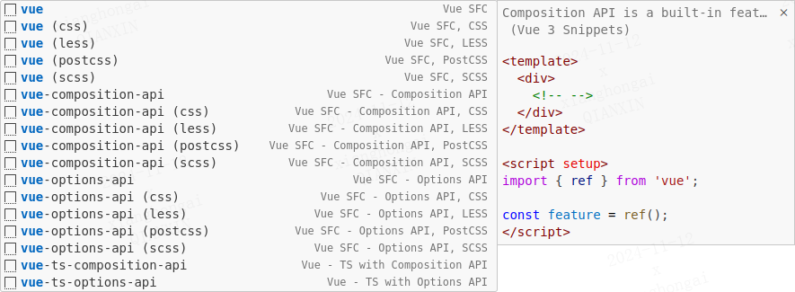

### Vue Language Blocks / SFC 语法定义


The `vue-script` prefix generates `<script>` language block, which contains a variety of API style scripting language blocks.

The `vue-style` prefix generates a `<style>` language block, which contains different style preprocessing language blocks.

--

`vue-script` 前缀生成 `<script>` 语言块，包含不同风格脚本语言块；

`vue-style` 前缀生成 `<style>` 语言块，包含不同样式预处理语言块。

| Prefix                                                  | VS Code Suggest Match | Snippet                                                                                                                                                                                                                                                                                                                                                                                                                        |
|---------------------------------------------------------|-----------------------|--------------------------------------------------------------------------------------------------------------------------------------------------------------------------------------------------------------------------------------------------------------------------------------------------------------------------------------------------------------------------------------------------------------------------------|
| `vue-script` <br><br> `vue-script-options-api`          |                       | <small><em>\<script\><br>export default {<br>&nbsp;&nbsp;name: 'TestIndex',<br><br>&nbsp;&nbsp;data() {<br>&nbsp;&nbsp;&nbsp;&nbsp;return {<br>&nbsp;&nbsp;&nbsp;&nbsp;&nbsp;&nbsp;<br>&nbsp;&nbsp;&nbsp;&nbsp;};<br>&nbsp;&nbsp;},<br><br>&nbsp;&nbsp;mounted() {<br>&nbsp;&nbsp;&nbsp;&nbsp;<br>&nbsp;&nbsp;},<br><br>&nbsp;&nbsp;methods: {<br>&nbsp;&nbsp;&nbsp;&nbsp;<br>&nbsp;&nbsp;},<br>};<br>\</script\></em></small> |
| `vue-script` <br><br> `vue-script-composition-api`      |                       | <small><em>\<script setup\><br><br>\</script\></em></small>                                                                                                                                                                                                                                                                                                                                                                    |
| `vue-script` <br><br> `vue-script-composition-api-hook` |                       | <small><em>\<script\><br>import { ref } from 'vue';<br><br>export default {<br>&nbsp;&nbsp;setup() {<br>&nbsp;&nbsp;&nbsp;&nbsp;const feature = ref();<br><br>&nbsp;&nbsp;&nbsp;&nbsp;return {<br>&nbsp;&nbsp;&nbsp;&nbsp;&nbsp;&nbsp;<br>&nbsp;&nbsp;&nbsp;&nbsp;};<br>&nbsp;&nbsp;},<br>};<br>\</script\></em></small>                                                                                                       |
| `vue-style-scss`                                        |                       | <small><em>\<style lang="scss" scoped\><br><br>\</style\></em></small>                                                                                                                                                                                                                                                                                                                                                         |
| `vue-style-less`                                        |                       | <small><em>\<style lang="less" scoped\><br><br>\</style\></em></small>                                                                                                                                                                                                                                                                                                                                                         |
| ...                                                     |                       |                                                                                                                                                                                                                                                                                                                                                                                                                                |

Full prefix screenshot (Language Blocks) / 完整前缀截图 (SFC 语法定义):

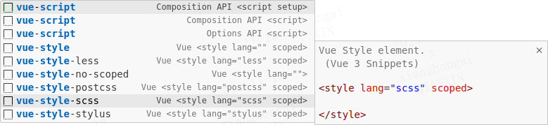


### Props Property

1. 直接生成 (Prefix)：`ps` = <small><em><strong><u style="color: red;">P</u></strong>rops, <strong><u style="color: red;">S</u></strong>tring</em></small>.
2. 联想匹配 (Suggest Match)：`pssdr` = <small><em><strong><u style="color: red;">P</u></strong>rop<strong><u style="color: red;">s</u></strong>, <strong><u style="color: red;">S</u></strong>tring, <strong><u style="color: red;">d</u></strong>efault, <strong><u style="color: red;">r</u></strong>equired</em></small>.

不同类型以此类推：

- <small><em><strong><u style="color: red;">S</u></strong>tring</em></small>，
- <small><em><strong><u style="color: red;">N</u></strong>umber</em></small>，
- <small><em><strong><u style="color: red;">B</u></strong>oolean</em></small>，
- <small><em><strong><u style="color: red;">A</u></strong>rray</em></small>，
- <small><em><strong><u style="color: red;">O</u></strong>bject</em></small>，
- <small><em><strong><u style="color: red;">D</u></strong>ate</em></small>，
- <small><em><strong><u style="color: red;">F</u></strong>unction</em></small>，
- <small><em><strong><u style="color: red;">S</u></strong>ymbol</em></small>，
- <small><em><strong><u style="color: red;">P</u></strong>romise</em></small>。

| Prefix                                   | VS Code Suggest Match | Snippet                                                                                                                                                                                                                                                                      |
|------------------------------------------|-----------------------|------------------------------------------------------------------------------------------------------------------------------------------------------------------------------------------------------------------------------------------------------------------------------|
| `props-String` / `ps`                    | `pss`                 | <small><em>property: <strong><u style="color: red;">S</u></strong>tring,</em></small>                                                                                                                                                                                        |
| `props-String-default` / `psd`           | `pssd`                | <small><em>property: {<br>&nbsp;&nbsp;type: <strong><u style="color: red;">S</u></strong>tring,<br>&nbsp;&nbsp;<strong><u style="color: red;">d</u></strong>efault: undefined,<br>},</em></small>                                                                            |
| `props-String-required` / `psr`          | `pssr`                | <small><em>property: {<br>&nbsp;&nbsp;type: <strong><u style="color: red;">S</u></strong>tring,<br>&nbsp;&nbsp;<strong><u style="color: red;">r</u></strong>equired: true,<br>},</em></small>                                                                                |
| `props-String-default-required` / `psdr` | `pssdr`               | <small><em>property: {<br>&nbsp;&nbsp;type: <strong><u style="color: red;">S</u></strong>tring,<br>&nbsp;&nbsp;<strong><u style="color: red;">d</u></strong>efault: undefined,<br>&nbsp;&nbsp;<strong><u style="color: red;">r</u></strong>equired: true,<br>},</em></small> |
| ...                                      |                       |                                                                                                                                                                                                                                                                              |

Full prefix screenshot (Props) / 完整前缀截图:


### Computed

| Prefix                               | VS Code Suggest Match | Snippet                                                                                                                                                                                                                                                                                                                                                                                   |
|--------------------------------------|-----------------------|-------------------------------------------------------------------------------------------------------------------------------------------------------------------------------------------------------------------------------------------------------------------------------------------------------------------------------------------------------------------------------------------|
| `computed-property` / `cp`           |                       | <small><em><strong><u style="color: red;">p</u></strong>roperty() {<br>&nbsp;&nbsp;return this.property;<br>},</em></small>                                                                                                                                                                                                                                                               |
| `computed-property-get-set` / `cpgs` |                       | <small><em><strong><u style="color: red;">p</u></strong>roperty: {<br>&nbsp;&nbsp;<strong><u style="color: red;">g</u></strong>et() {<br>&nbsp;&nbsp;&nbsp;&nbsp;return this.value;<br>&nbsp;&nbsp;},<br>&nbsp;&nbsp;<strong><u style="color: red;">s</u></strong>et(val) {<br>&nbsp;&nbsp;&nbsp;&nbsp;this.value = val;<br>&nbsp;&nbsp;},<br>},</em></small>                             |
| `computed`                           | `cd`                  | <small><em>const feature = <strong><u style="color: red;">c</u></strong>ompute<strong><u style="color: red;">d</u></strong>(() => state.value);</em></small>                                                                                                                                                                                                                              |
| `computed-get-set`                   | `cdgs`                | <small><em>const feature = <strong><u style="color: red;">c</u></strong>ompute<strong><u style="color: red;">d</u></strong>({<br>&nbsp;&nbsp;<strong><u style="color: red;">g</u></strong>et: () => state.value,<br>&nbsp;&nbsp;<strong><u style="color: red;">s</u></strong>et: (newValue) => {<br>&nbsp;&nbsp;&nbsp;&nbsp;state.value = newValue;<br>&nbsp;&nbsp;},<br>});</em></small> |

The prefix screenshot (Computed) / 前缀截图:

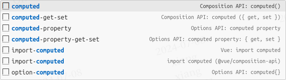

### Watch (Composition API)

1. 联想匹配 (Suggest Match)：`wps` = <small><em><strong><u style="color: red;">w</u></strong>atch-<strong><u style="color: red;">p</u></strong>rop<strong><u style="color: red;">s</u></strong></em></small>。
2. 联想匹配 (Suggest Match)：`wim` = <small><em><strong><u style="color: red;">w</u></strong>atch-<strong><u style="color: red;">im</u></strong>mediate</em></small>。

| Prefix                           | VS Code Suggest Match | Snippet                                                                                                                                                                                                                                                                                                                                                                                                                                                                                                                 |
|----------------------------------|-----------------------|-------------------------------------------------------------------------------------------------------------------------------------------------------------------------------------------------------------------------------------------------------------------------------------------------------------------------------------------------------------------------------------------------------------------------------------------------------------------------------------------------------------------------|
| `watch-props`                    | `wps`                 | <small><em><strong><u style="color: red;">w</u></strong>atch(<br>&nbsp;&nbsp;() => <strong><u style="color: red;">p</u></strong>rop<strong><u style="color: red;">s</u></strong>.property,<br>&nbsp;&nbsp;async (newValue, oldValue) => {<br>&nbsp;&nbsp;&nbsp;&nbsp;<br>&nbsp;&nbsp;},<br>);</em></small>                                                                                                                                                                                                              |
| `watch-props-deep`               | `wpsd`                | <small><em><strong><u style="color: red;">w</u></strong>atch(<br>&nbsp;&nbsp;() => <strong><u style="color: red;">p</u></strong>rop<strong><u style="color: red;">s</u></strong>.property,<br>&nbsp;&nbsp;async (newValue, oldValue) => {<br>&nbsp;&nbsp;&nbsp;&nbsp;<br>&nbsp;&nbsp;},<br>&nbsp;&nbsp;{<br>&nbsp;&nbsp;&nbsp;&nbsp;<strong><u style="color: red;">d</u></strong>eep: true,<br>&nbsp;&nbsp;}<br>);</em></small>                                                                                         |
| `watch-props-immediate`          | `wpsi`                | <small><em><strong><u style="color: red;">w</u></strong>atch(<br>&nbsp;&nbsp;() => <strong><u style="color: red;">p</u></strong>rop<strong><u style="color: red;">s</u></strong>.property,<br>&nbsp;&nbsp;async (newValue, oldValue) => {<br>&nbsp;&nbsp;&nbsp;&nbsp;<br>&nbsp;&nbsp;},<br>&nbsp;&nbsp;{<br>&nbsp;&nbsp;&nbsp;&nbsp;<strong><u style="color: red;">i</u></strong>mmediate: true,<br>&nbsp;&nbsp;}<br>);</em></small>                                                                                    |
| `watch-props-deep-immediate`     | `wpsdi`               | <small><em><strong><u style="color: red;">w</u></strong>atch(<br>&nbsp;&nbsp;() => <strong><u style="color: red;">p</u></strong>rop<strong><u style="color: red;">s</u></strong>.property,<br>&nbsp;&nbsp;async (newValue, oldValue) => {<br>&nbsp;&nbsp;&nbsp;&nbsp;<br>&nbsp;&nbsp;},<br>&nbsp;&nbsp;{<br>&nbsp;&nbsp;&nbsp;&nbsp;<strong><u style="color: red;">d</u></strong>eep: true,<br>&nbsp;&nbsp;&nbsp;&nbsp;<strong><u style="color: red;">i</u></strong>mmediate: true,<br>&nbsp;&nbsp;}<br>);</em></small> |
| `watch-props-immediate-multiple` | `wpsimu`              | <small><em><strong><u style="color: red;">w</u></strong>atch(<br>&nbsp;&nbsp;[() => <strong><u style="color: red;">p</u></strong>rop<strong><u style="color: red;">s</u></strong>.property1, () => props.property2],<br>&nbsp;&nbsp;async ([property1, property2]) => {<br>&nbsp;&nbsp;&nbsp;&nbsp;<br>&nbsp;&nbsp;},<br>&nbsp;&nbsp;{<br>&nbsp;&nbsp;&nbsp;&nbsp;<strong><u style="color: red;">i</u></strong>mmediate: true,<br>&nbsp;&nbsp;}<br>);</em></small>                                                      |
| `watch`                          |                       | <small><em>watch(<br>&nbsp;&nbsp;source,<br>&nbsp;&nbsp;async (newValue, oldValue) => {<br>&nbsp;&nbsp;&nbsp;&nbsp;<br>&nbsp;&nbsp;},<br>);</em></small>                                                                                                                                                                                                                                                                                                                                                                |
| `watch-deep`                     | `wd`                  | <small><em><strong><u style="color: red;">w</u></strong>atch(<br>&nbsp;&nbsp;source,<br>&nbsp;&nbsp;async (newValue, oldValue) => {<br>&nbsp;&nbsp;&nbsp;&nbsp;<br>&nbsp;&nbsp;},<br>&nbsp;&nbsp;{<br>&nbsp;&nbsp;&nbsp;&nbsp;<strong><u style="color: red;">d</u></strong>eep: true,<br>&nbsp;&nbsp;}<br>);</em></small>                                                                                                                                                                                               |
| `watch-immediate`                | `wim`                 | <small><em><strong><u style="color: red;">w</u></strong>atch(<br>&nbsp;&nbsp;source,<br>&nbsp;&nbsp;async (newValue, oldValue) => {<br>&nbsp;&nbsp;&nbsp;&nbsp;<br>&nbsp;&nbsp;},<br>&nbsp;&nbsp;{<br>&nbsp;&nbsp;&nbsp;&nbsp;<strong><u style="color: red;">im</u></strong>mediate: true,<br>&nbsp;&nbsp;}<br>);</em></small>                                                                                                                                                                                          |
| `watch-deep-immediate`           | `wdi`                 | <small><em><strong><u style="color: red;">w</u></strong>atch(<br>&nbsp;&nbsp;source1,<br>&nbsp;&nbsp;async (newValue, oldValue) => {<br>&nbsp;&nbsp;&nbsp;&nbsp;<br>&nbsp;&nbsp;},<br>&nbsp;&nbsp;{<br>&nbsp;&nbsp;&nbsp;&nbsp;<strong><u style="color: red;">d</u></strong>eep: true,<br>&nbsp;&nbsp;&nbsp;&nbsp;<strong><u style="color: red;">i</u></strong>mmediate: true,<br>&nbsp;&nbsp;}<br>);</em></small>                                                                                                      |
| `watch-immediate-multiple`       | `wim`                 | <small><em><strong><u style="color: red;">w</u></strong>atch(<br>&nbsp;&nbsp;[source1, source2],<br>&nbsp;&nbsp;async ([nextSource1, nextSource2], [prevSource1, prevSource2]) => {<br>&nbsp;&nbsp;&nbsp;&nbsp;<br>&nbsp;&nbsp;},<br>&nbsp;&nbsp;{<br>&nbsp;&nbsp;&nbsp;&nbsp;<strong><u style="color: red;">i</u></strong>mmediate: true,<br>&nbsp;&nbsp;}<br>);</em></small>                                                                                                                                          |
| `watchEffect`                    | `wef`                 | <small><em><strong><u style="color: red;">w</u></strong>atch<strong><u style="color: red;">Ef</u></strong>fect(async () => {<br>&nbsp;&nbsp;<br>});</em></small>                                                                                                                                                                                                                                                                                                                                                        |
| `watchPostEffect`                | `wpef`                | <small><em><strong><u style="color: red;">w</u></strong>atch<strong><u style="color: red;">P</u></strong>ost<strong><u style="color: red;">Ef</u></strong>fect(async () => {<br>&nbsp;&nbsp;<br>});</em></small>                                                                                                                                                                                                                                                                                                        |
| `watchSyncEffect`                | `wsef`                | <small><em><strong><u style="color: red;">w</u></strong>atch<strong><u style="color: red;">S</u></strong>ync<strong><u style="color: red;">Ef</u></strong>fect(() => {<br>&nbsp;&nbsp;<br>});</em></small>                                                                                                                                                                                                                                                                                                              |

The prefix screenshot (Watch) / 前缀截图:


### Watch (Options API)

1. 直接生成 (Prefix)：`wp` = <small><em><strong><u style="color: red;">w</u></strong>atch-<strong><u style="color: red;">p</u></strong>roperty</em></small>。
2. 联想匹配 (Suggest Match)：`wpdi` = <small><em><strong><u style="color: red;">w</u></strong>atch-<strong><u style="color: red;">p</u></strong>roperty-<strong><u style="color: red;">d</u></strong>eep-<strong><u style="color: red;">i</u></strong>mmediate</em></small>。

| Prefix                                   | VS Code Suggest Match | Snippet                                                                                                                                                                                                                                                                                                                             |
|------------------------------------------|-----------------------|-------------------------------------------------------------------------------------------------------------------------------------------------------------------------------------------------------------------------------------------------------------------------------------------------------------------------------------|
| `watch-property` / `wp`                  |                       | <small><em><strong><u style="color: red;">p</u></strong>roperty (newValue, oldValue) {<br>&nbsp;&nbsp;<br>},</em></small>                                                                                                                                                                                                           |
| `watch-property-deep` / `wpd`            |                       | <small><em><strong><u style="color: red;">p</u></strong>roperty: {<br>&nbsp;&nbsp;<strong><u style="color: red;">d</u></strong>eep: true,<br>&nbsp;&nbsp;handler(newValue, oldValue) {<br>&nbsp;&nbsp;&nbsp;&nbsp;<br>&nbsp;&nbsp;},<br>},</em></small>                                                                             |
| `watch-property-immediate` / `wpi`       |                       | <small><em><strong><u style="color: red;">p</u></strong>roperty: {<br>&nbsp;&nbsp;<strong><u style="color: red;">i</u></strong>mmediate: true,<br>&nbsp;&nbsp;handler(newValue, oldValue) {<br>&nbsp;&nbsp;&nbsp;&nbsp;<br>&nbsp;&nbsp;},<br>},</em></small>                                                                        |
| `watch-property-deep-immediate` / `wpdi` |                       | <small><em><strong><u style="color: red;">p</u></strong>roperty: {<br>&nbsp;&nbsp;<strong><u style="color: red;">d</u></strong>eep: true,<br>&nbsp;&nbsp;<strong><u style="color: red;">i</u></strong>mmediate: true,<br>&nbsp;&nbsp;handler(newValue, oldValue) {<br>&nbsp;&nbsp;&nbsp;&nbsp;<br>&nbsp;&nbsp;},<br>},</em></small> |

The prefix screenshot (Watch) / 前缀截图:


### Lifecycle Hooks (Composition API)

The `on` prefix generates Vue Lifecycle Hooks, Some examples:

--

通过 `on` 前缀触发，包涵所有生成 Vue 生命周期钩子的代码片段，示例如下：

| Prefix            | VS Code Suggest Match | Snippet                                                                                                                                                        |
|-------------------|-----------------------|----------------------------------------------------------------------------------------------------------------------------------------------------------------|
| `onBeforeMount`   | `onbm`                | <small><em><strong><u style="color: red;">onB</u></strong>efore<strong><u style="color: red;">M</u></strong>ount(() => {<br>&nbsp;&nbsp;<br>});</em></small>   |
| `onMounted`       | `onm`                 | <small><em><strong><u style="color: red;">onM</u></strong>ounted(() => {<br>&nbsp;&nbsp;<br>});</em></small>                                                   |
| `onBeforeUpdate`  | `onbup`               | <small><em><strong><u style="color: red;">onB</u></strong>efore<strong><u style="color: red;">U</u></strong>pdate(() => {<br>&nbsp;&nbsp;<br>});</em></small>  |
| `onUpdated`       | `onup`                | <small><em><strong><u style="color: red;">onUp</u></strong>dated(() => {<br>&nbsp;&nbsp;<br>});</em></small>                                                   |
| `onBeforeUnmount` | `onbu`                | <small><em><strong><u style="color: red;">onB</u></strong>efore<strong><u style="color: red;">U</u></strong>nmount(() => {<br>&nbsp;&nbsp;<br>});</em></small> |
| `onUnmounted`     | `onum`                | <small><em><strong><u style="color: red;">onU</u></strong>n<strong><u style="color: red;">m</u></strong>ounted(() => {<br>&nbsp;&nbsp;<br>});</em></small>     |
| `onActivated`     | `ona`                 | <small><em><strong><u style="color: red;">onA</u></strong>ctivated(() => {<br>&nbsp;&nbsp;<br>});</em></small>                                                 |
| `onDeactivated`   | `onda`                | <small><em><strong><u style="color: red;">onD</u></strong>e<strong><u style="color: red;">a</u></strong>ctivated(() => {<br>&nbsp;&nbsp;<br>});</em></small>   |
| `async-onMounted` | `asonm`               | <small><em><strong><u style="color: red;">onM</u></strong>ounted(<strong><u style="color: red;">as</u></strong>ync () => {<br>&nbsp;&nbsp;<br>});</em></small> |

The prefix screenshot (Lifecycle Hooks) / 前缀截图:


### Lifecycle Hooks (Options API)

Just `ol*`...

只要**理解** `ol` 是 <small><em><strong><u style="color: red;">O</u></strong>ptions API <strong><u style="color: red;">L</u></strong>ifecycle Hooks</em></small> 的缩写，并**记忆** Vue3 生命周期钩子，然后就能释放你的能量了。

| Prefix                             | VS Code Suggest Match | Snippet                                                                                                                                                 |
|------------------------------------|-----------------------|---------------------------------------------------------------------------------------------------------------------------------------------------------|
| `option-beforeCreate()` / `olbc`   | `opbc`                | <small><em><strong><u style="color: red;">b</u></strong>efore<strong><u style="color: red;">C</u></strong>reate() {<br>&nbsp;&nbsp;<br>},</em></small>  |
| `option-created()` / `olc`         | `opcr`                | <small><em><strong><u style="color: red;">c</u></strong>reated() {<br>&nbsp;&nbsp;<br>},</em></small>                                                   |
| `option-beforeMount()` / `olbm`    | `opbm`                | <small><em><strong><u style="color: red;">b</u></strong>efore<strong><u style="color: red;">M</u></strong>ount() {<br>&nbsp;&nbsp;<br>},</em></small>   |
| `option-mounted()` / `olm`         | `opmu`                | <small><em><strong><u style="color: red;">m</u></strong>ounted() {<br>&nbsp;&nbsp;<br>},</em></small>                                                   |
| `option-beforeUpdate()` / `olbu`   | `opbu`                | <small><em><strong><u style="color: red;">b</u></strong>efore<strong><u style="color: red;">U</u></strong>pdate() {<br>&nbsp;&nbsp;<br>},</em></small>  |
| `option-updated()` / `olu`         | `opu`                 | <small><em><strong><u style="color: red;">u</u></strong>pdated() {<br>&nbsp;&nbsp;<br>},</em></small>                                                   |
| `option-activated()` / `ola`       | `opac`                | <small><em><strong><u style="color: red;">a</u></strong>ctivated() {<br>&nbsp;&nbsp;<br>},</em></small>                                                 |
| `option-deactivated()` / `olda`    | `opdeac`              | <small><em><strong><u style="color: red;">d</u></strong>e<strong><u style="color: red;">a</u></strong>ctivated() {<br>&nbsp;&nbsp;<br>},</em></small>   |
| `option-beforeDestroy()` / `olbd`  | `opbd`                | <small><em><strong><u style="color: red;">b</u></strong>efore<strong><u style="color: red;">D</u></strong>estroy() {<br>&nbsp;&nbsp;<br>},</em></small> |
| `option-destroyed()` / `old`       | `opdes`               | <small><em><strong><u style="color: red;">d</u></strong>estroyed() {<br>&nbsp;&nbsp;<br>},</em></small>                                                 |
| `async-option-created()` / `asolc` | `asopcr`              | <small><em><strong><u style="color: red;">as</u></strong>ync <strong><u style="color: red;">c</u></strong>reated() {<br>&nbsp;&nbsp;<br>},</em></small> |
| `async-option-mounted()` / `asolm` | `asopmu`              | <small><em><strong><u style="color: red;">as</u></strong>ync <strong><u style="color: red;">m</u></strong>ounted() {<br>&nbsp;&nbsp;<br>},</em></small> |

The prefix screenshot (Lifecycle Hooks) / 前缀截图:

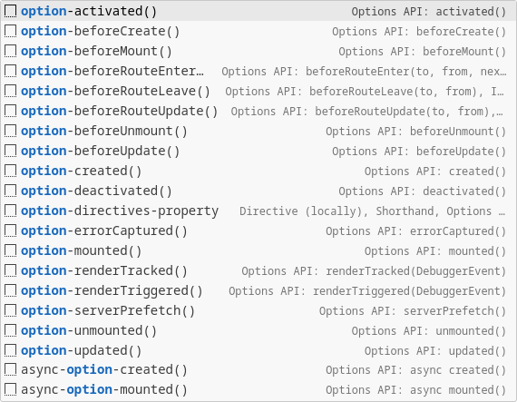

### Options API

The `option-` prefix generates Vue Options API Code, Examples:

--

通过 `option-` 前缀触发，包涵所有生成 Vue 选项式 API 的代码片段，示例如下：

| Prefix                             | VS Code Suggest Match | Snippet                                                                                                                                                                                                                   |
|------------------------------------|-----------------------|---------------------------------------------------------------------------------------------------------------------------------------------------------------------------------------------------------------------------|
| `option-name`                      |                       | <small><em>name: 'FileName',</em></small>                                                                                                                                                                                 |
| `option-components` <br><br> `ocs` |                       | <small><em><strong><u style="color: red;">c</u></strong>omponent<strong><u style="color: red;">s</u></strong>: { Feature },</em></small>                                                                                  |
| `option-directives` <br><br> `ods` |                       | <small><em><strong><u style="color: red;">d</u></strong>irective<strong><u style="color: red;">s</u></strong>: {<br>&nbsp;&nbsp;<br>},</em></small>                                                                       |
| `option-props` <br><br> `ops`      | `opps`                | <small><em><strong><u style="color: red;">p</u></strong>rop<strong><u style="color: red;">s</u></strong>: {<br>&nbsp;&nbsp;<br>},</em></small>                                                                            |
| `option-provide()` <br><br> `ope`  |                       | <small><em><strong><u style="color: red;">p</u></strong>rovid<strong><u style="color: red;">e</u></strong>() {<br>&nbsp;&nbsp;return {<br>&nbsp;&nbsp;&nbsp;&nbsp;property: 'value',<br>&nbsp;&nbsp;};<br>},</em></small> |
| `option-inject` <br><br> `oit`     |                       | <small><em><strong><u style="color: red;">i</u></strong>njec<strong><u style="color: red;">t</u></strong>: ['property'],</em></small>                                                                                     |
| `option-data()` <br><br> `od`      | `opd`                 | <small><em><strong><u style="color: red;">d</u></strong>ata() {<br>&nbsp;&nbsp;return {<br>&nbsp;&nbsp;&nbsp;&nbsp;property: 'value',<br>&nbsp;&nbsp;};<br>},</em></small>                                                |
| `option-computed` <br><br> `oc`    | `opc`                 | <small><em><strong><u style="color: red;">c</u></strong>omputed: {<br>&nbsp;&nbsp;property() {<br>&nbsp;&nbsp;&nbsp;&nbsp;return this.property;<br>&nbsp;&nbsp;},<br>},</em></small>                                      |
| `option-watch` <br><br> `ow`       | `opw`                 | <small><em><strong><u style="color: red;">w</u></strong>atch: {<br>&nbsp;&nbsp;<br>},</em></small>                                                                                                                        |
| `option-methods` <br><br> `om`     | `opm`                 | <small><em><strong><u style="color: red;">m</u></strong>ethods: {<br>&nbsp;&nbsp;methodProperty() {<br>&nbsp;&nbsp;&nbsp;&nbsp;<br>&nbsp;&nbsp;},<br>},</em></small>                                                      |
| `methods-property` <br><br> `mp`   |                       | <small><em><strong><u style="color: red;">m</u></strong>ethod<strong><u style="color: red;">P</u></strong>roperty() {<br>&nbsp;&nbsp;<br>},</em></small>                                                                  |
| `option-emits`                     |                       | <small><em>emits: \['eventName'\],</em></small>                                                                                                                                                                           |
| `option-expose`                    |                       | <small><em>expose: \['publicMethod'\],</em></small>                                                                                                                                                                       |
| `option-render`                    |                       | <small><em>render(h, context) {<br>&nbsp;&nbsp;return h('tag', []);<br>},                                                                                                                                                 |
| ...                                |                       |                                                                                                                                                                                                                           |

The prefix screenshot (Options API) / 前缀截图 (选项式 API):

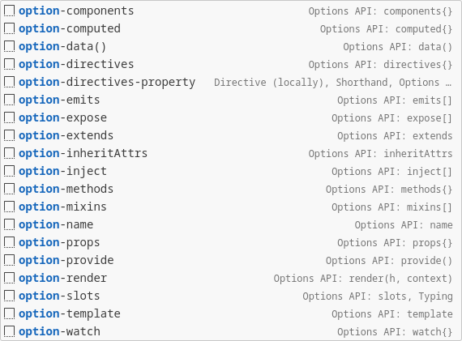

### Instance Properties & Methods

All instance properties and methods are triggered with the `vm` prefix, such as:

所有实例属性和方法都以 `vm` 前缀触发，部分示例如下：

| Prefix                       | VS Code Suggest Match | Snippet                                                                                                                                                                             |
|------------------------------|-----------------------|-------------------------------------------------------------------------------------------------------------------------------------------------------------------------------------|
| `vm-nextTick`                |                       | <small><em>this.$<strong><u style="color: red;">n</u></strong>ext<strong><u style="color: red;">T</u></strong>ick().then(() => {<br>&nbsp;&nbsp;<br>});</em></small>                |
| `await-vm-nextTick` / `vmnt` | `awvmnt`              | <small><em><strong><u style="color: red;">aw</u></strong>ait this.$<strong><u style="color: red;">n</u></strong>ext<strong><u style="color: red;">T</u></strong>ick();</em></small> |
| `vm-emit`                    | `vmem`                | <small><em>this.$<strong><u style="color: red;">em</u></strong>it('event-name', param);</em></small>                                                                                |
| `nt` / `await-nextTick`      | `awnt`                | <small><em>await nextTick();</em></small>                                                                                                                                           |
| `nextTick`                   | `ntt`                 | <small><em>nextTick().then(() => {<br>&nbsp;&nbsp;<br>});</em></small>                                                                                                              |
| `emit`                       |                       | <small><em><strong><u style="color: red;">em</u></strong>it('event-name', param);</em></small>                                                                                      |
| ...                          |                       |                                                                                                                                                                                     |


Full prefix screenshot (Vue Instance) / 完整前缀截图 (Vue 实例):

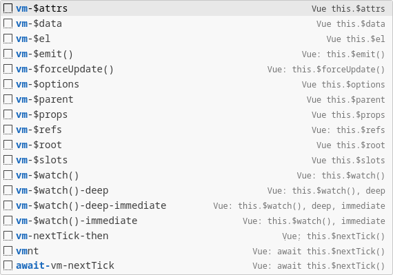

### Built-ins Directives

The `v` prefix generates Vue Directives, some examples:

`v` 前缀触发，包涵大量 Vue 模板语法代码片段，部分示例如下：

| Prefix               | VS Code Suggest Match | Snippet                                                                                                                                                                                                 |
|----------------------|-----------------------|---------------------------------------------------------------------------------------------------------------------------------------------------------------------------------------------------------|
| `v-for`              | `vf`                  | <small><em><strong><u style="color: red;">v</u></strong>-<strong><u style="color: red;">f</u></strong>or="item in items" :key="item"</em></small>                                                       |
| `v-for-index`        | `vfi`                 | <small><em><strong><u style="color: red;">v</u></strong>-<strong><u style="color: red;">f</u></strong>or="(item, <strong><u style="color: red;">i</u></strong>ndex) in items" :key="index"</em></small> |
| `v-slot`             |                       | <small><em>\<template #default="slotProps"\><br>&nbsp;&nbsp;<br>\</template\></em></small>                                                                                                              |
| `v-slot-named`       |                       | <small><em>\<template #name\><br>&nbsp;&nbsp;<br>\</template\></em></small>                                                                                                                             |
| `v-slot-named-props` |                       | <small><em>\<template #name="slotProps"\><br>&nbsp;&nbsp;<br>\</template\></em></small>                                                                                                                 |
| `v-on`               |                       | <small><em>@click="handler"</em></small>                                                                                                                                                                |
| `v-on-prevent`       |                       | <small><em>@click.prevent="handler"</em></small>                                                                                                                                                        |
| `v-on-stop`          |                       | <small><em>@click.stop="handler"</em></small>                                                                                                                                                           |
| `v-on-prevent-stop`  |                       | <small><em>@click.stop.prevent="handler"</em></small>                                                                                                                                                   |
| `v-on-keyAlias`      |                       | <small><em>@keyup.enter="handler"</em></small>                                                                                                                                                          |
| `v-on-once`          |                       | <small><em>@click.once="handler"</em></small>                                                                                                                                                           |
| `v-if`               |                       | <small><em>v-if="condition"</em></small>                                                                                                                                                                |
| `v-else-if`          |                       | <small><em>v-else-if="condition"</em></small>                                                                                                                                                           |
| `v-show`             |                       | <small><em>v-show="condition"</em></small>                                                                                                                                                              |
| ...                  |                       |                                                                                                                                                                                                         |


Full prefix screenshot (`v-`) / 完整前缀截图 (Vue 内置指令):

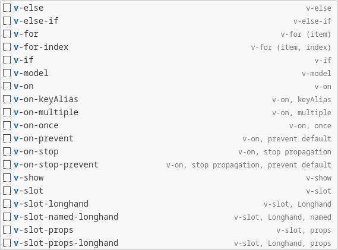

### Built-ins Components & Special Elements

| Prefix             | VS Code Suggest Match | Snippet                                                                                                                                                              |
|--------------------|-----------------------|----------------------------------------------------------------------------------------------------------------------------------------------------------------------|
| `transition`       |                       | <small><em>\<transition name="name"\><br>&nbsp;&nbsp;<br>\</transition\></em></small>                                                                                |
| `transition-group` | `tg`                  | <small><em>\<transition-group name="list" tag="ul"\><br>&nbsp;&nbsp;<br>\</transition-group\></em></small>                                                           |
| `keep-alive`       | `ka`                  | <small><em>\<keep-alive\><br>&nbsp;&nbsp;<br>\</keep-alive\></em></small>                                                                                            |
| `suspense`         |                       | <small><em>\<suspense\><br>&nbsp;&nbsp;<br>&nbsp;&nbsp;\<template #fallback\><br>&nbsp;&nbsp;&nbsp;&nbsp;<br>&nbsp;&nbsp;\</template\><br>\</suspense\></em></small> |
| `teleport`         |                       | <small><em>\<teleport to="selector"\><br>&nbsp;&nbsp;<br>\</teleport\></em></small>                                                                                  |
| `slot`             |                       | <small><em>\<slot\>\</slot\></em></small>                                                                                                                            |
| `slot-name`        |                       | <small><em>\<slot :prop="var"\>\</slot\></em></small>                                                                                                                |
| `slot-scope`       |                       | <small><em>\<slot name="name"\>\</slot\></em></small>                                                                                                                |
| `slot-name-scope`  | `snc`                 | <small><em>\<slot name="name" :prop="var"\>\</slot\></em></small>                                                                                                    |
| ...                |                       |                                                                                                                                                                      |

(1). Transition classes / 用于自定义过渡 class Props

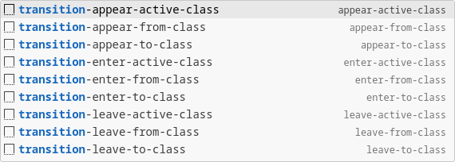

(2). Transition events / 过渡事件

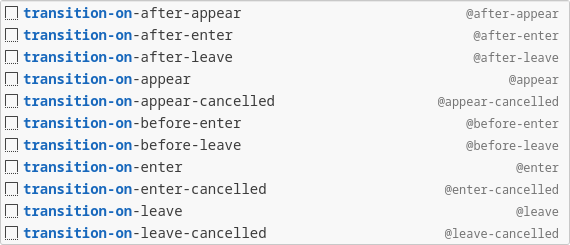

(3). Transition css / 过渡 CSS 类

`css-transitions`。

### Vue Router v4.x

The `route-`/`vmroute-` or `router-`/`vmrouter-` prefix generates Vue Router, Some examples:

如果是 Composition API，可通过 `route-` 或 `router-` 前缀触发；

如果是 Options API，可通过 `vmroute-` 或 `vmrouter-` 前缀触发。

包涵大量 Vue Router v4.x API 代码片段，部分示例如下：

| Prefix                             | VS Code Suggest Match | Snippet                                                                                                                                                                                                                                                  |
|------------------------------------|-----------------------|----------------------------------------------------------------------------------------------------------------------------------------------------------------------------------------------------------------------------------------------------------|
| `createRouter`                     |                       | <small><em>import { createRouter, createWebHistory } from 'vue-router';<br><br>const router = createRouter({<br>&nbsp;&nbsp;history: createWebHistory(),<br>&nbsp;&nbsp;routes,<br>});<br><br>// app.use(router);<br>export default router;</em></small> |
| `useRoute`                         |                       | <small><em>const route = useRoute();</em></small>                                                                                                                                                                                                        |
| `useRouter`                        |                       | <small><em>const router = useRouter();</em></small>                                                                                                                                                                                                      |
| `useLink`                          |                       | <small><em>const { href, isActive, isExactActive, navigate, route } = useLink({<br>&nbsp;&nbsp;to: '/pathname'<br>});</em></small>                                                                                                                       |
| `onBeforeRouteUpdate`              |                       | <small><em>onBeforeRouteUpdate(async (to, from) => {<br>&nbsp;&nbsp;<br>});</em></small>                                                                                                                                                                 |
| `onBeforeRouteLeave`               |                       | <small><em>onBeforeRouteLeave(async (to, from) => {<br>&nbsp;&nbsp;<br>});</em></small>                                                                                                                                                                  |
| `route`                            |                       | <small><em>{<br>&nbsp;&nbsp;path: 'pathName',<br>&nbsp;&nbsp;component: Feature,<br>},</em></small>                                                                                                                                                      |
| `route-name`                       |                       | <small><em>{<br>&nbsp;&nbsp;path: '/pathName',<br>&nbsp;&nbsp;name: 'routeName',<br>&nbsp;&nbsp;component: Feature,<br>},</em></small>                                                                                                                   |
| `route-redirect-name`              |                       | <small><em>{<br>&nbsp;&nbsp;path: '/feature/:id',<br>&nbsp;&nbsp;redirect: {<br>&nbsp;&nbsp;&nbsp;&nbsp;name: 'routeName',<br>&nbsp;&nbsp;},<br>},</em></small>                                                                                          |
| `router-push-name-params-query`    |                       | <small><em>router.push({<br>&nbsp;&nbsp;name: 'routename',<br>&nbsp;&nbsp;params: { property: 'value' },<br>&nbsp;&nbsp;query: { property: 'value' },<br>});</em></small>                                                                                |
| `vm-router-push-name-params-query` |                       | <small><em>this.$router.push({<br>&nbsp;&nbsp;name: 'routename',<br>&nbsp;&nbsp;params: { property: 'value' },<br>&nbsp;&nbsp;query: { property: 'value' },<br>});</em></small>                                                                          |
| `router-beforeEach`                |                       | <small><em>router.beforeEach((to, from) => {<br>&nbsp;&nbsp;<br>});</em></small>                                                                                                                                                                         |
| `option-route-beforeRouteLeave`    |                       | <small><em>beforeRouteLeave(to, from) {<br>&nbsp;&nbsp;<br>},</em></small>                                                                                                                                                                               |
| ...                                |                       |                                                                                                                                                                                                                                                          |

Full prefix screenshot (Vue Router) / 完整前缀截图 (Vue 路由):

(1). Define Route / 定义路由

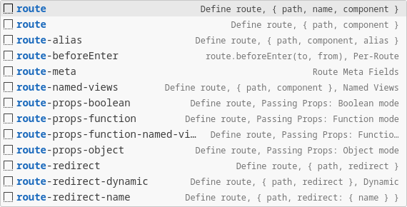

(2). Router Instance (Options API) / Router 实例 (选项式接口)

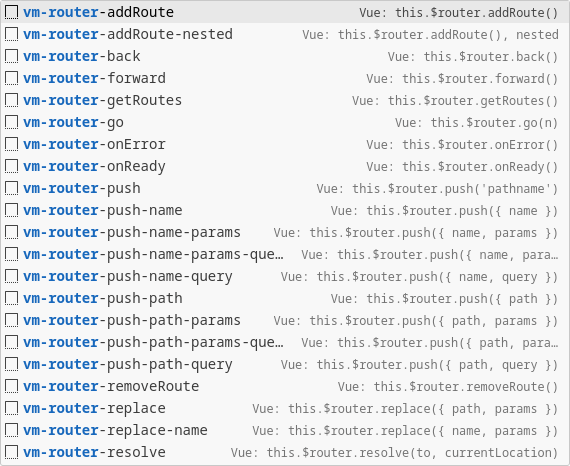

(3). Route Property (Options API) / Route 属性 (选项式接口)

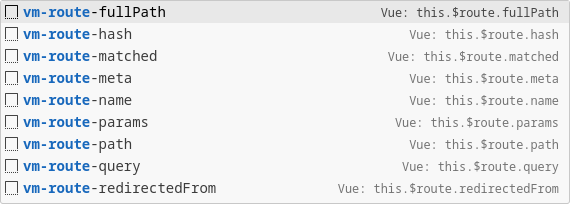

(4). Router Instance (Composition API) / Router 实例 (组合式接口)

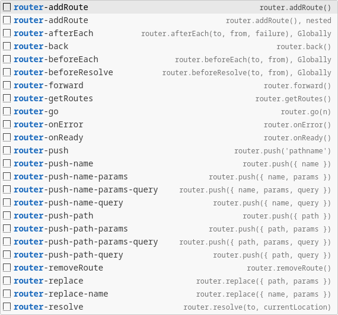

#### Vue Route v4.x - Custom Component

| Prefix                           | VS Code Suggest Match | Snippet                                                                                                                                                                                                                                                                                 |
|----------------------------------|-----------------------|-----------------------------------------------------------------------------------------------------------------------------------------------------------------------------------------------------------------------------------------------------------------------------------------|
| `router-view`                    | `rv`                  | <small><em>\<router-view\>\</router-view\></em></small>                                                                                                                                                                                                                                 |
| `router-view-named`              | `rvn`                 | <small><em>\<router-view name="default"\>\</router-view\></em></small>                                                                                                                                                                                                                  |
| `router-link`                    | `rl`                  | <small><em>\<router-link :to=""\><br>&nbsp;&nbsp;<br>\</router-link\></em></small>                                                                                                                                                                                                      |
| `router-link-named-params-query` | `rlnpq`               | <small><em>\<router-link<br>&nbsp;&nbsp;:to="{<br>&nbsp;&nbsp;&nbsp;&nbsp;name: 'routeName',<br>&nbsp;&nbsp;&nbsp;&nbsp;params: { property: 'value' },<br>&nbsp;&nbsp;&nbsp;&nbsp;query: { property: 'value' },<br>&nbsp;&nbsp;}"<br>><br>&nbsp;&nbsp;<br>\</router-link\></em></small> |
| `router-params`                  |                       | <small><em>params: {<br>&nbsp;&nbsp;property: 'value',<br>},</em></small>                                                                                                                                                                                                               |
| `router-query`                   |                       | <small><em>query: {<br>&nbsp;&nbsp;property: 'value',<br>},</em></small>                                                                                                                                                                                                                |
| ...                              |                       |                                                                                                                                                                                                                                                                                         |

Full prefix screenshot (Vue Router Custom Component) / 完整前缀截图 (Vue 路由自定义组件):

`<router-link>`

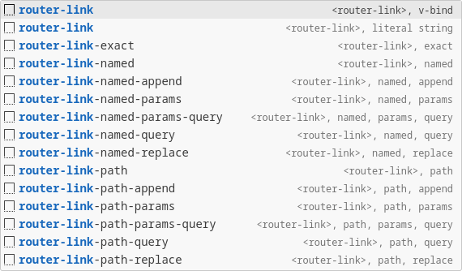

`<router-view>`

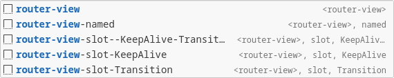


### Why isn't there Pinia? / 为什么没有 Pinia

In Vue 2.x, Vuex is used, while in Vue 3.x, Pinia is adopted. There are costs associated with migrating at the project level. Reusing components at the component level couples them with the state management library. Using a state library doesn't make much sense; state sharing can be achieved entirely through Vue [Dependency Injection](https://vuejs.org/api/composition-api-dependency-injection.html).

--

Vue 2.x 中采用 VueX，Vue 3.x 采用 Pinia，项目级别迁移有成本，组件级别复用耦合了状态管理库，用状态库没多大意义，状态共享完全可以通过 Vue [依赖注入](https://cn.vuejs.org/api/composition-api-dependency-injection.html)实现。

## Supported languages (file extensions) 🌈

- JavaScript (`.js`)
- TypeScript (`.ts`)
- HTML (`.html`)
- Vue (`.vue`)
- CSS (`.css`)

## Resources 🤞

- [Vue 2 Snippets](https://marketplace.visualstudio.com/items?itemName=NicholasHsiang.vscode-vue2-snippets), For Vue 2.
- [Pinia Snippets](https://marketplace.visualstudio.com/items?itemName=NicholasHsiang.vscode-pinia-snippets), For Pinia.
- [VueX Snippets](https://marketplace.visualstudio.com/items?itemName=NicholasHsiang.vscode-vuex-snippets), For VueX.
- [JavaScript Code Snippet](https://marketplace.visualstudio.com/items?itemName=NicholasHsiang.vscode-vue3-snippets), Reference MDN documentation.
- [JavaScript Comment Snippet](https://marketplace.visualstudio.com/items?itemName=NicholasHsiang.vscode-javascript-comment), Reference JSDOC, ESDOC documentation.

---

## License 📃

MIT License.

## Donate 🎉


